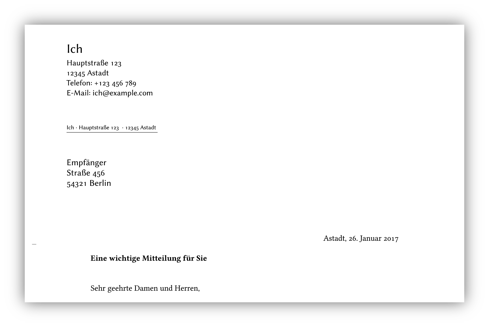

# latex-letter-boilerplate

> Boilerplate for a simple German LaTeX letter



This contains a [`document.tex`](boilerplate/document.tex) and a [`Makefile`](boilerplate/Makefile) for easier use of `latexmk`.


## Getting started

In your working directory, run:

```
$ curl -fsSL https://github.com/uschek/latex-letter-boilerplate/archive/master.tar.gz | tar -xz --strip-components=2 latex-letter-boilerplate-master/boilerplate
```

To build, run:

```sh
$ make
```


## License

MIT © [Christoph Uschkrat](https://c.uschkrat.com)
